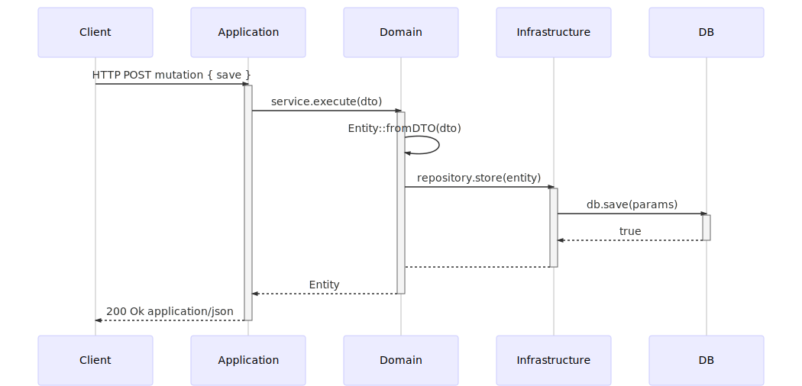

### Requisitos

- [NodeJS](https://nodejs.org/en/)

### Instalação

- Instalando Pacotes
    
    `yarn install`

### Comandos de Desenvolvimento

- Criando uma migration para banco de dados

  `yarn migrate:dev`

- Executar TSLint

  `yarn lint`

- Executar Tests 

  `yarn test`

"Falta Implementar os Testes"

### Arquitetura

- Esse sistema é desenvolvido baseado na [Arquitetura Hexagonal ou Ports & Adapters](https://blog.octo.com/en/hexagonal-architecture-three-principles-and-an-implementation-example/).

- A imagem é uma visão geral de como é o fluxo de mensagem do sistema.
  
  *Diagrama criado com [mermaid](http://knsv.github.io/mermaid/). Veja o código em [docs/diagrams](docs/diagrams)*

  - **Client**: Componente externo responsável por enviar a requisição para o a aplicação, no exemplo da imagem pode ser uma página web (React, AngularJS, etc.) ou uma ferramenta de teste de API (Insominia, Postman, etc).
  
  - **Application**: Responsável por receber e tratar as entradas de dados para enviar para a camada de domínio ou de infraestrutura. Na camada de Application é possível manipular requisições via HTTP, comando de terminal (CLI), consumer se filas (RabbitMQ), e outros.
  
  - **Domain**: Onde fica toda regra de negócio da aplicação, os casos de uso e as entidades.

  - **Infrastructure**: Responsável por acessar recursos externos, como banco de dados, APIs de terceiro, arquivos em disco, etc.   
  
